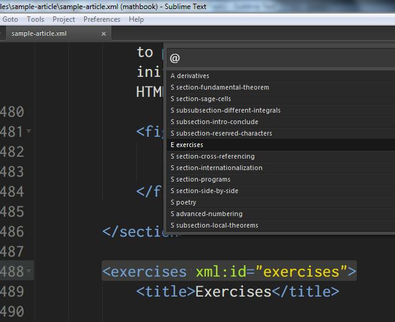

# MBXTools: a Sublime Text package for MathBook XML

MBXTools is a Sublime Text package designed to assist authors using
[MathBook XML](https://github.com/rbeezer/mathbook). It is very experimental
and may behave unexpectedly.

The package is inspired by the excellent
[LaTeXTools](https://github.com/SublimeText/LaTeXTools) package, which I have
enjoyed using for many years. I have borrowed very liberally from the
LaTeXTools codebase in order to implement the features I thought would be most
useful to MBX authors. Please let me know of any bugs you find or any features
you would like to include.

### Installation

It is recommended to install MBXTools via [Package
Control](https://packagecontrol.io). If you have not installed Package Control
yet, you should do that first (and restart Sublime Text afterward).

After Package Control is installed, use the `Install Package` command to search
for the MBXTools package, and select it from the Quick Panel to install. This
method of installation allows Package Control to automatically update your
installation and show you appropriate release notes.

You may also install MBXTools via `git`. Change directories into your
`Packages` folder. To find the `Packages` folder, select Browse Packages from
the Preferences menu (from the Sublime Text 3 menu on OS X). Make sure you are
in the `Packages` folder and *not* `Packages/User`.

Then, run
```
git clone https://github.com/daverosoff/MBXTools.git
```
and restart Sublime Text (probably not necessary).

### Keybindings

MBXTools is inspired by
[LaTeXTools](https://packagecontrol.io/packages/LaTeXTools), and like that
package uses a <kbd>Ctrl+l</kbd> prefix for many commands. The Expand Selection
to Line command is bound to <kbd>Ctrl+l</kbd> by default. MBXTools rebinds that
command to <kbd>Ctrl+l, Ctrl+l</kbd>. Note that this is a keyboard shortcut
consisting of two separate keystroke combinations. Most MBXTools shortcuts are
like this.

### Usage

You can activate the package features by enabling the MathBook XML syntax. The
syntax definition looks for `.mbx` file extensions, which most of us don't use
(yet?). If your MBX files end with `.xml`, you will either need to add a
comment to the first line of each file (after the XML declaration):
```
<!-- MBX -->
```
or you will need to enable the syntax manually using the command palette. To
enable it manually, open an MBX file and press <kbd>Ctrl+Shift+P</kbd>
(<kbd>Cmd+Shift+P</kbd> on OS X) and type `mbx`. Select `Set Syntax: MathBook
XML` from the list of options.

You should see the text `MathBook XML` in the lower right corner if you have
the status bar visible (command palette: Toggle Status Bar).


There are only a few features implemented so far.

1. If you have some subdivisions (with `@xml:id`) in your MBX file, hit
   `Ctrl-R` (`Cmd-R` on OS X) to run the Go To Symbol command. You should see a
   panel showing all your available sections. Select one to jump to it in the
   active view. This tool does not index subdivisions without an `@xml:id` attribute.



2. If you have been using `@xml:id` to label your stuff, try typing `<xref
   ref="` (the beginning of a cross-reference). Sublime Text should show you a
   panel containing all xml:id values along with the elements they go with.
   Choose one to insert it at the caret and close the `xref` tag.
   Alternatively, type `ref` and hit `Tab` to activate the `xref` snippet. Then
   hit <kbd>Ctrl+L, X</kbd> or <kbd>Ctrl+L, Ctrl+Space</kbd> to bring up the
   completions menu. There are several variants of the `ref` snippet, namely
   `refa`, `refp`, and `refpa`.


3. Type `chp`, `sec`, `ssec`, or `sssec` and hit `Tab` to activate the
   subdivision snippets. A blank `title` element is provided and the cursor
   positioned within it. As you type, the `@xml:id` field for the subdivision
   is filled with similar text mirroring the title you are entering.

### Known issues

*  The `ref` snippet does not bring up the quick panel. Should it?
*  Recursive search through included files for labels is not yet implemented
   for `xref` completion. As of 0.3.0 it does work for Goto Symbol in Project.
* Nothing has been tested on OS X or Linux.
